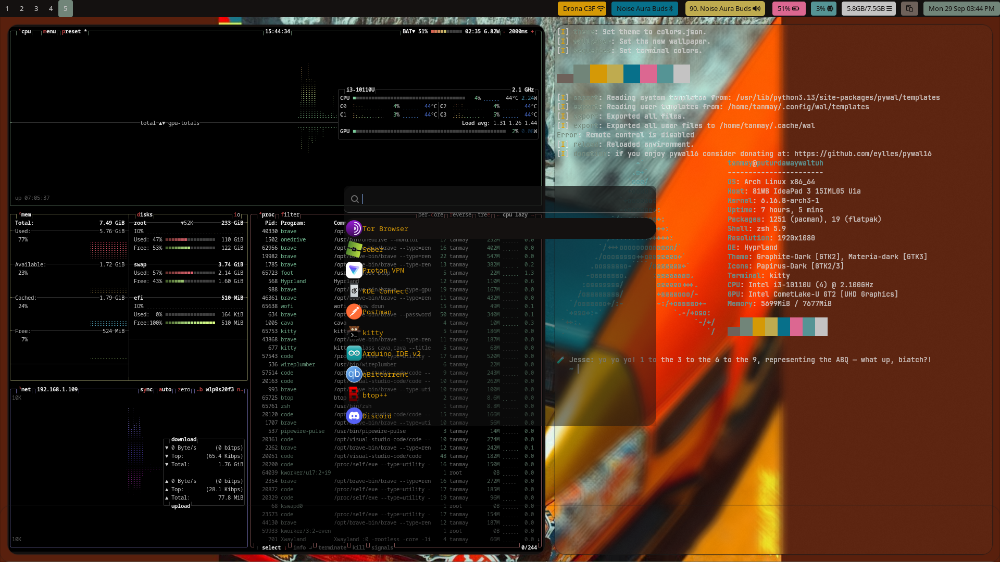

# ⚡ TanmayHutt's Hyprland Dotfiles 🧪

My personal, high-performance **Hyprland** and **Zsh** configuration setup, tuned for **Arch Linux**. This repository is focused on speed, aesthetics, and a powerful, keyboard-driven workflow.

---

## 📸 Showcase

Here’s a glimpse of the desktop environment in action:



---

## ✨ Features & Highlights

This configuration is built for a clean and efficient Linux experience:

* [cite_start]**Window Manager**: `Hyprland` with dynamic tiling, featuring **10px inner gaps**, **15px outer gaps**, and **20px window rounding**[cite: 257, 258].
* [cite_start]**Aesthetics**: System-wide theming via **Pywal**, with automatic reload on terminal startup[cite: 43].
* [cite_start]**Terminal (Kitty)**: Uses a custom color scheme and displays system information using `neofetch` on launch[cite: 45].
* [cite_start]**Shell (Zsh)**: Powered by Oh My Zsh, with essential plugins like `zsh-autosuggestions`, `zsh-syntax-highlighting`, `z`, and `sudo`[cite: 39].
    * [cite_start]Includes a fun **"Jesse Pinkman" inspired welcome quote** (`jesse_quote`)[cite: 42].
* [cite_start]**Visualizer (CAVA)**: Configured with custom shaders for visual effects, including `eye_of_phi.frag`, `northern_lights.frag`, and `winamp_line_style_spectrum.frag`[cite: 2].
* [cite_start]**Application Launcher (Wofi)**: Styled as a **transparent dark window with frosted glass blur** and shadow [cite: 280-282]. [cite_start]It supports images and uses the prompt: `"Yo, search it!"`[cite: 279].
* [cite_start]**Bar (Waybar)**: Configuration inherits colors from Pywal and includes specific module styling[cite: 272].
* [cite_start]**Lockscreen (Hyprlock)**: Displays time, date, battery, network, and supports a profile picture [cite: 260-265].
* [cite_start]**Platform Support**: Sets environment variables for Wayland (`QT_QPA_PLATFORM=wayland;xcb`) and input methods (`fcitx`)[cite: 19, 43].

---

## 📂 Repository Structure

The core files reside in the following directories:

```text
└── tanmayhutt-hyprland-dotfiles/
    ├── README.md
    ├── deploy.sh               # The quick setup script
    ├── power-toggle.sh         # Custom power profile cycler script
    ├── push.sh                 # Git auto-commit/push helper
    ├── .zprofile               # Zsh login shell (Hyprland startup on TTY1)
    ├── .zshrc                  # Zsh interactive shell config, plugins, and aliases
    └── .config/
        ├── cava/               # CAVA config, themes (solarized_dark, tricolor), and shaders
        ├── hypr/               # Primary Hyprland config files, keybinds.conf, brightness-volume.sh, hyprpaper.conf
        ├── hyprlock/           # Lock screen configuration (hyprlock.conf)
        ├── kitty/              # Kitty terminal config (kitty.conf)
        ├── waybar/             # Status bar config and style.css
        └── wofi/               # App launcher config and style.css
```

---

## 🗝️ Key Bindings

| Action | Key Binding | Command / Details |
| :--- | :--- | :--- |
| **Terminal** | `Super` + `T` | `kitty` |
| **App Launcher** | `Super` + `A` | `wofi --show drun` |
| **File Manager** | `Super` + `E` | `thunar` |
| **Browser** | `Super` + `B` | `brave` |
| **Kill Window** | `Super` + `Q` | `killactive` |
| **Lock Screen** | `Super` + `L` | `hyprlock` |
| **System Monitor** | `Super` + `M` | `foot btop` |
| **Suspend** | `Super` + `Esc` | `systemctl suspend` |
| **Full Screenshot** | `Print` | `grim` (to file & clipboard) |
| **Region Screenshot** | `Shift` + `Print` | `grim -g "$(slurp)"` (to file & clipboard) |

---

## ⚙️ Helper Scripts

* **`deploy.sh`**
  Creates symbolic links for all configuration directories and Zsh files into your `$HOME` and `$HOME/.config`. [cite_start]This is the **one-command setup** after cloning[cite: 11].
  ```zsh
  ~/hyprland-dotfiles/deploy.sh
  ```
* **`push.sh`**
  Stages all files, commits with an automatic timestamped message ("Auto update:..."), and pushes changes to GitHub. The success message is "All pushed, Heisenberg style!".
  ```zsh
  ~/hyprland-dotfiles/push.sh
  ```
* **`power-toggle.sh`**
  Cycles the system power profile using powerprofilesctl between performance, balanced, and power-saver. A desktop notification is sent on every switch.
  ```zsh
  ~/hyprland-dotfiles/power-toggle.sh
  ```

---


## 🛠️ Installation

1. **`Backup:`** It is highly recommended to back up your existing configuration files (important!).
2. **`Clone:`** Clone the repository to your home directory:
   ```zsh
   git clone [https://github.com/tanmayhutt/hyprland-dotfiles.git](https://github.com/tanmayhutt/hyprland-dotfiles.git)
   ```
3. **`Deploy:`** Run the deployment script to set up the symbolic links:
   ```zsh
   ~/hyprland-dotfiles/deploy.sh
   ```
4. **`Reload:`** Log out and log back into $\text{Hyprland}$ to apply all the new configurations. 


